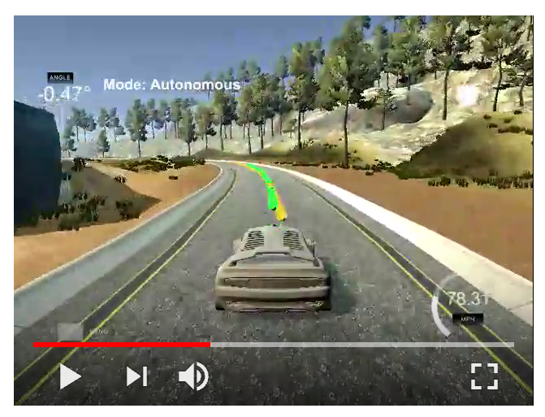

# MPC Controller
Project 5 of term 2 of Udacity self-driving car nanodegree.
  

Description of our implementation is available [here](writeup.md).

## Setup

This project involves the Term 2 Simulator which can be downloaded [here](https://github.com/udacity/self-driving-car-sim/releases).
Follow instructions [here](https://github.com/udacity/CarND-MPC-Project) to set up Ubuntu and Mac environments.

## Usage

1. Set up project environemnt as specified above.
2. Compile the files to create the main executable of the project:
    * Make a build directory: `mkdir build && cd build`
    * Compile: `cmake .. && make`
3. Run Term 2 Simulator
4. In the simulator, press "Next" button twice to switch to Project 5, then press "Select" button.
5. Run the main executable ( build/mpc )of the project.

## Files

* src - folder of source files
* mpc.mp4 - video of the car driving 3 laps using MPC controller
* writeup.md - description of implementation of MPC controller
